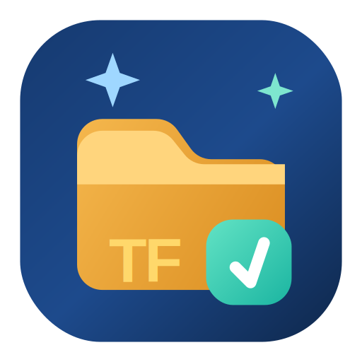
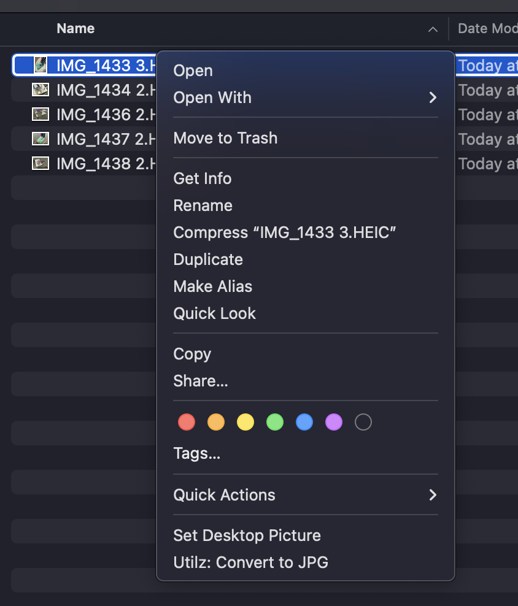

# macOS Right Click Shortcuts

<p align="center">
  
</p>

Small Finder utilities for macOS, starting with a Finder Quick Action that converts common image files to JPG.

This repo installs Finder Quick Actions for two jobs:

- `Utilz: Convert to JPG` for converting supported image files to `.jpg`
- `Utilz: Setup New Repo` for scaffolding a new Git-ready repository inside a selected folder



## Features

- Adds a Finder Quick Action called `Utilz: Convert to JPG`
- Adds a Finder Quick Action called `Utilz: Setup New Repo`
- Converts common image formats with the built-in `sips` tool
- Prompts for a repo name and creates a new baseline Git repository inside a selected folder
- Installs a terminal command, `setup_new_repo`, so you can scaffold new repos from any shell
- Writes output next to the original file
- Avoids overwriting by creating names like `photo 2.jpg`
- Keeps the project simple enough to extend with more right-click utilities later

## Install

```bash
chmod +x scripts/install.sh scripts/uninstall.sh scripts/test.sh scripts/install-git-hooks.sh scripts/deploy.sh scripts/convert-image-to-jpg.sh
./scripts/install.sh
```

Before a commit or release, run:

```bash
zsh scripts/test.sh
```

If this directory is a Git repository, you can also enforce that automatically with:

```bash
./scripts/install-git-hooks.sh
```

To run checks and push the current branch in one step:

```bash
./scripts/deploy.sh
```

The installer copies:

- The conversion helper into `~/Library/Application Support/MacOS Right Click Shortcuts/`
- The Quick Action bundle into `~/Library/Services/`

If Finder does not show the action immediately, refresh Finder:

```bash
killall Finder
```

If macOS still hides it, open:

`System Settings > Privacy & Security > Extensions > Finder`

## Usage

### Convert Images to JPG

1. Select one or more supported image files in Finder.
2. Right-click the selection.
3. Choose `Utilz: Convert to JPG`.
4. The converted `.jpg` files appear beside the originals.

Supported input formats currently include `.png`, `.heic`, `.heif`, `.webp`, `.gif`, `.bmp`, `.tif`, and `.tiff`.

### Setup a New Repo

1. Select a folder in Finder where the new repo should be created.
2. Right-click the folder.
3. Choose `Utilz: Setup New Repo`.
4. Enter the new repo name in the popup dialog.
5. Utilz creates a new subfolder with a baseline Git setup, hook installer, test script, and deploy script.

### Setup a New Repo From Terminal

After running `./scripts/install.sh`, open a new shell and run:

```bash
setup_new_repo my-new-repo
```

That creates `./my-new-repo` from the current directory. You can also run:

```bash
setup_new_repo.sh my-new-repo
```

If you run `setup_new_repo` with no arguments, it prompts for the repo name and creates the repo in the current directory.

## How it works

The project ships a real macOS `.workflow` bundle in [`templates/Convert to JPG.workflow/Contents/Info.plist`](templates/Convert%20to%20JPG.workflow/Contents/Info.plist) and [`templates/Convert to JPG.workflow/Contents/Resources/document.wflow`](templates/Convert%20to%20JPG.workflow/Contents/Resources/document.wflow).

The image conversion action calls [`scripts/convert-image-to-jpg.sh`](scripts/convert-image-to-jpg.sh), which uses macOS `sips` to do the actual conversion.

The repo bootstrap action calls [`scripts/setup-new-repo.sh`](scripts/setup-new-repo.sh), which copies the baseline template from [`templates/repo-baseline`](templates/repo-baseline), initializes Git, and installs the versioned pre-commit hook in the generated repo.

## Testing

Run the full project checks with:

```bash
zsh scripts/test.sh
```

To enforce those checks before every commit, install the versioned pre-commit hook with:

```bash
./scripts/install-git-hooks.sh
```

To run the same checks and push the current branch after they pass:

```bash
./scripts/deploy.sh
```

That script currently covers:

- Shell syntax validation for the helper and install scripts
- Plist validation for the workflow metadata
- Embedded self-tests in [`scripts/convert-image-to-jpg.sh`](scripts/convert-image-to-jpg.sh)
- Successful conversion behavior
- Unique output naming
- Silent JPG passthrough handling
- Unsupported file messaging
- Conversion failure messaging
- Syntax validation for the repo bootstrap helper and baseline scripts

## Project Layout

```text
.
├── assets/demo-finder-menu.png
├── assets/utilz-logo.svg
├── scripts/convert-image-to-jpg.sh
├── scripts/deploy.sh
├── scripts/setup-new-repo.sh
├── scripts/install.sh
├── scripts/uninstall.sh
├── templates/Convert to JPG.workflow/
├── templates/Setup New Repo.workflow/
└── templates/repo-baseline/
```

## Roadmap

- Add WebP export
- Add resize presets
- Add clipboard and filename utilities
- Add proper release packaging and code signing

## Troubleshooting

If conversion fails:

- Verify the file opens in Preview
- Make sure the file format is one of the supported image types
- Run `./scripts/install.sh` again to refresh the installed helper

If Finder does not show the Quick Action:

- Relaunch Finder with `killall Finder`
- Check `~/Library/Services/Utilz - Convert to JPG.workflow` exists
- Re-enable Finder extensions in System Settings if needed

## License

MIT
